# Lucrarea de laborator nr. 2  
## Introducere în WordPress

---

# Scopul lucrării

Scopul acestei lucrări este de a învăța instalarea WordPress într-un mediu local, familiarizarea cu panoul de administrare, modificarea aspectului site-ului prin utilizarea temelor și extinderea funcționalității cu ajutorul plugin-urilor.

---

# Pregătirea mediului

Pentru realizarea lucrării a fost utilizat mediul local **XAMPP**, care conține serverul web Apache și sistemul de baze de date MySQL.

## Pași realizați

1. Am instalat aplicația **XAMPP**.
2. Am pornit modulele:
   - Apache
   - MySQL

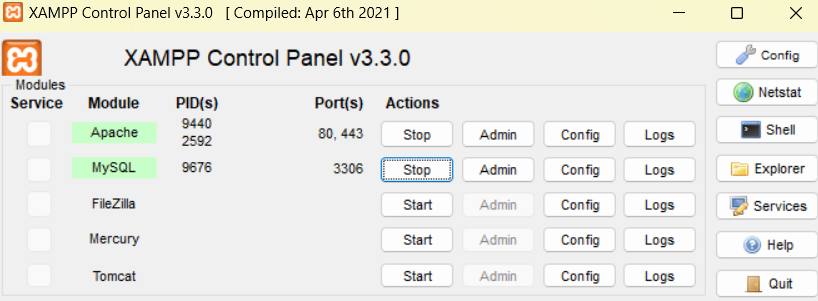
3. Am verificat funcționarea serverului accesând localhost
4. Am deschis **phpMyAdmin**
5. Am creat baza de date wp_project_test

---

# Instalarea WordPress

## Pași realizați

1. Am descărcat WordPress de pe site-ul oficial:

https://wordpress.org

2. Am dezarhivat arhiva WordPress.
3. Am copiat folderul în directorul:

4. Am deschis în browser:

5. Am parcurs procesul de instalare introducând:

- Database Name: `wp_project_test`
- Username: `root`
- Password: ""
- Database Host: `localhost`

6. Am creat contul de administrator pentru WordPress.

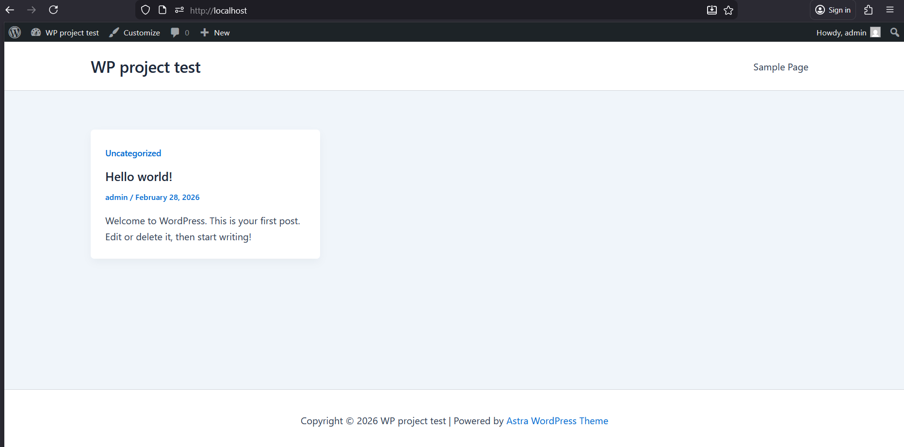

---

# Setările inițiale ale site-ului

După instalare, au fost configurate setările generale ale site-ului.

## Settings → General

Au fost modificate următoarele:

- **Site Title**
- **Tagline**
- **Timezone**

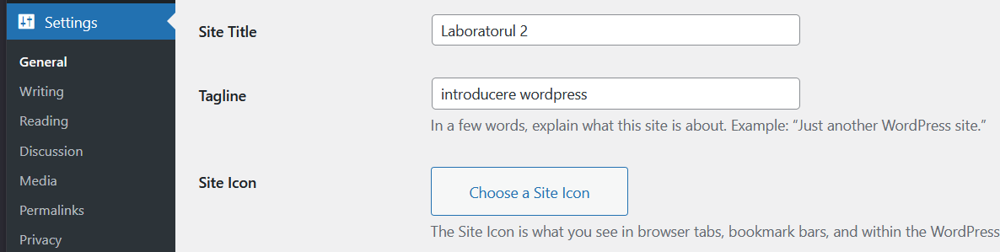
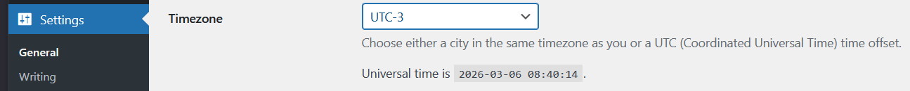

## Settings → Permalinks

Pentru linkuri mai prietenoase am selectat:

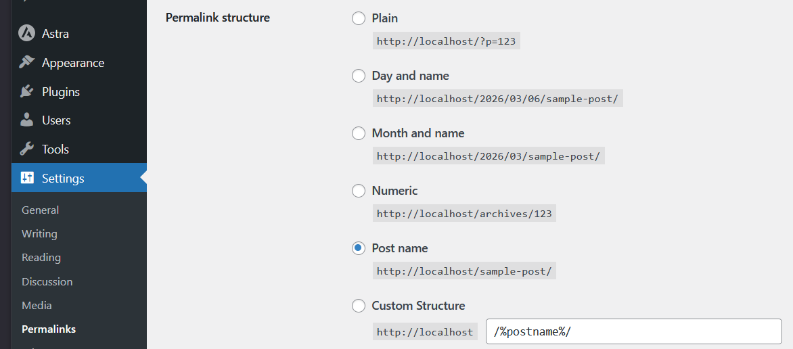

---

# Lucrul cu teme

Temele în WordPress controlează **aspectul vizual al site-ului**.

## Pași realizați

1. Am accesat meniul (Appearance → Themes):

2. Am selectat **Add New**.

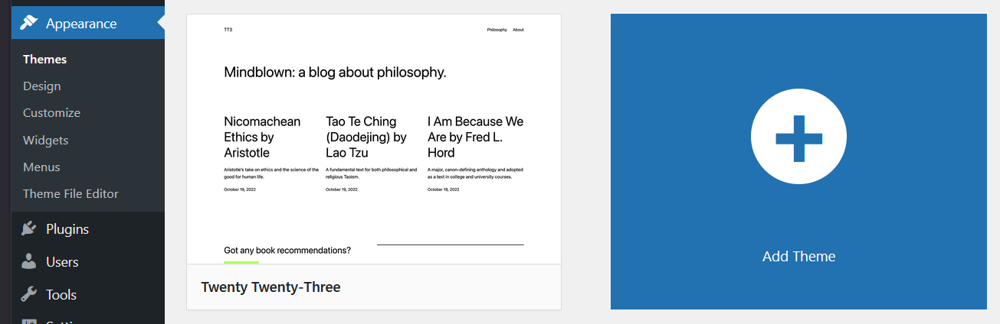

3. Am instalat tema Astra:

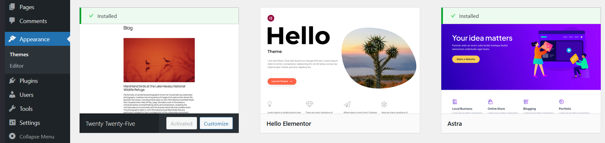

4. Am activat tema.

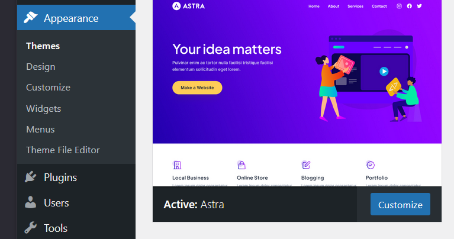

## Personalizarea temei

Din meniul (Appearance → Customize):

au fost configurate:

- logo-ul site-ului
- schema de culori
- titlul și descrierea

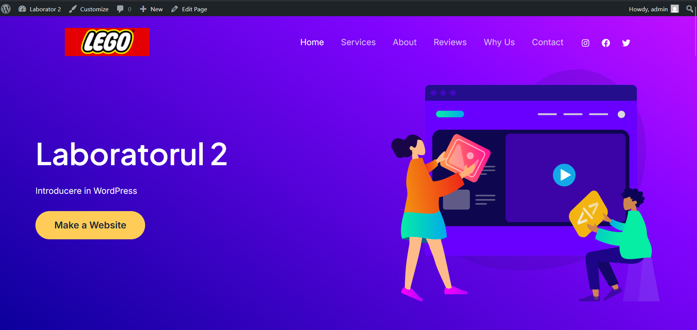

---

# Lucrul cu plugin-uri

Plugin-urile permit **extinderea funcționalității WordPress** fără a modifica codul.

## Instalarea pluginurilor

Am accesat (Plugins → Add New):

### Pluginuri instalate

1. **Classic Editor**
2. **Contact Form 7**

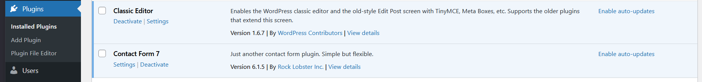

### Testarea pluginurilor

- Am creat o postare folosind **Classic Editor**.

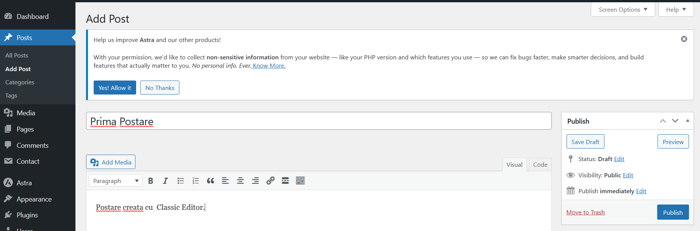

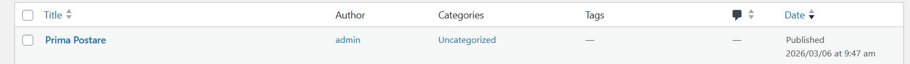

- Am creat un formular folosind **Contact Form 7**.

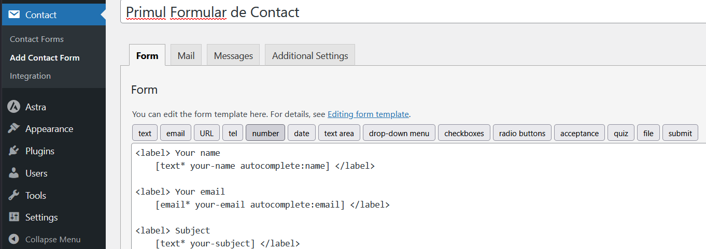

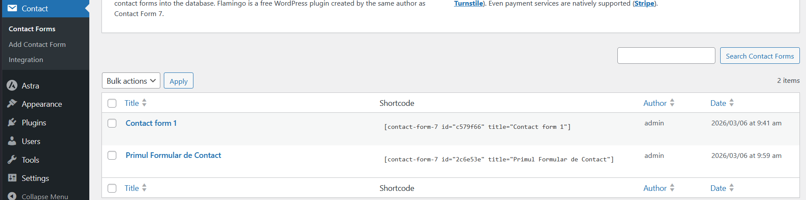

### Dezactivarea pluginului

Din meniul:

am dezactivat Contact Form 7 și am observat că a dispărut optiunea de Contact.

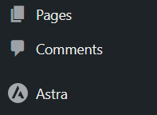

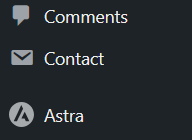

---

# Crearea de conținut

## Pagina Contacte

Am creat pagina (Pages -> Add Page):

Am inserat formularul creat cu **Contact Form 7**.

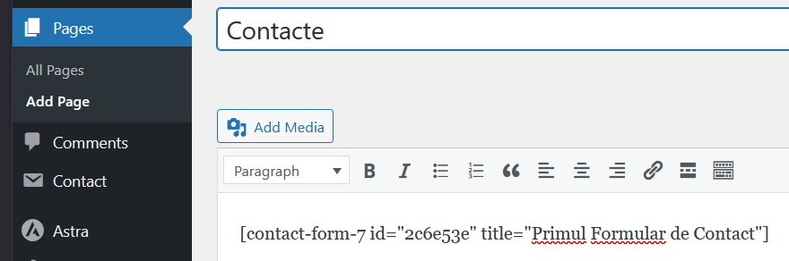

Am vizualizat pagina:

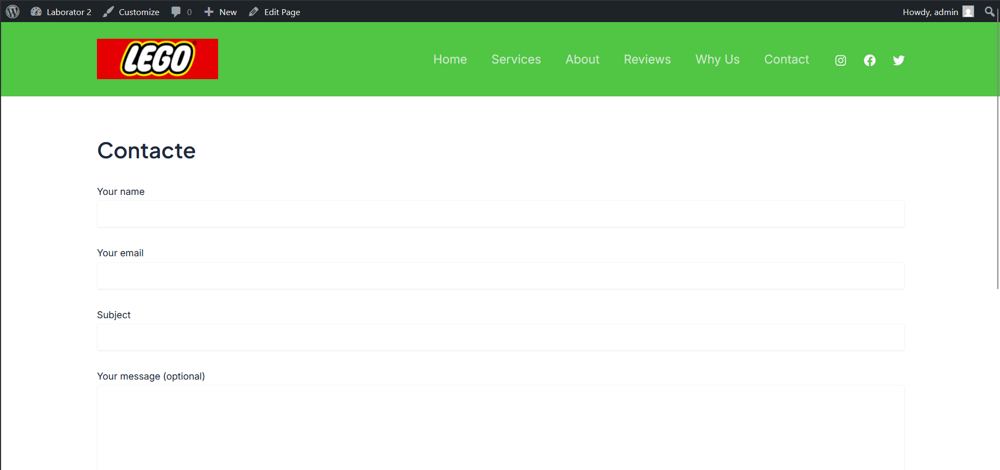

---

## Postări pe blog

Am creat o postare cu imagine:

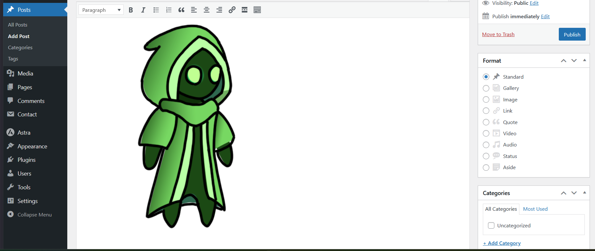

---

Am aranjat in pagina:

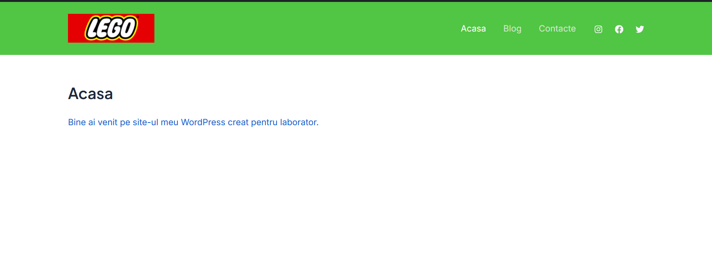
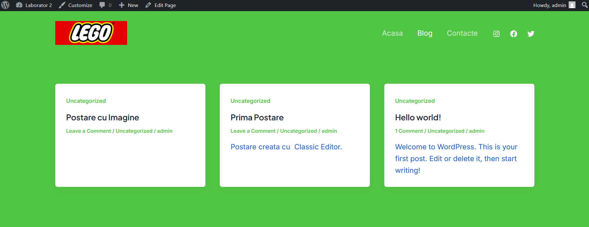
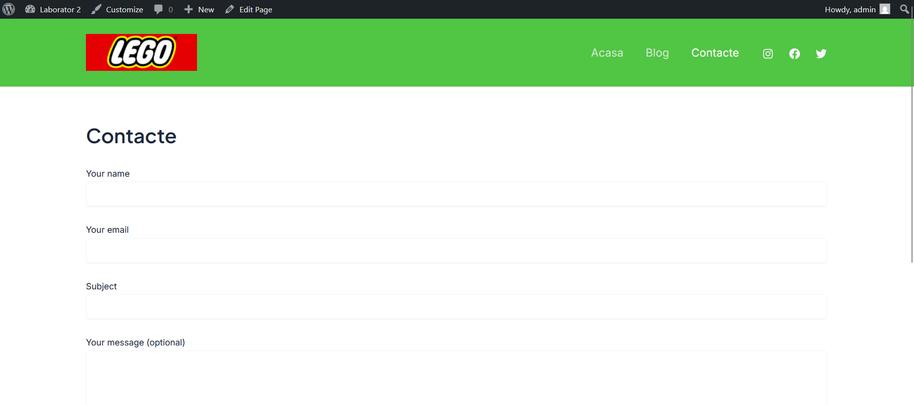

# Întrebări de control

## 1. Ce face o temă în WordPress și ce face un plugin?

Tema controlează **designul și aspectul vizual al site-ului**, cum ar fi layout-ul, culorile, fonturile și structura paginilor.

Pluginurile adaugă **funcționalități suplimentare** site-ului, cum ar fi formulare de contact, SEO, galerii foto sau sisteme de securitate.

---

## 2. De ce nu se pierde conținutul site-ului atunci când se schimbă tema?

Conținutul site-ului este stocat în **baza de date WordPress**, iar tema controlează doar modul în care acest conținut este afișat. Din acest motiv, schimbarea temei nu afectează postările sau paginile existente.

---

## 3. Cum se poate modifica aspectul site-ului fără a edita codul?

Aspectul site-ului poate fi modificat fără programare prin:

- instalarea unei teme diferite
- utilizarea meniului **Appearance → Customize**
- utilizarea pluginurilor de tip **page builder** (Elementor, Gutenberg, etc.)

---

# Concluzie

În cadrul acestei lucrări de laborator am instalat WordPress într-un mediu local folosind XAMPP, am configurat setările inițiale ale site-ului și am explorat funcționalitățile principale ale platformei. De asemenea, am instalat și configurat teme și pluginuri pentru a modifica designul și funcționalitatea site-ului, precum și am creat conținut sub formă de pagini și postări.

---
