# Lucrare de laborator nr. 3 — USM Theme

Temă WordPress personalizată dezvoltată ca lucrare de laborator.

---

## 1. Instrucțiuni pentru rularea proiectului

**Cerințe:** PHP ≥ 7.4, WordPress ≥ 5.0, MySQL, server local (XAMPP).

**Instructiuni:** 

Pentru tema simpla, copiati folderul **usm-theme** in `wp-content/themes/`

Pentru tema mai avansata, cu design mai modern, copiati folderul **usm-theme-modificat** in `wp-content/themes/`

---

## 2. Descrierea lucrării de laborator

**Scopul:** Crearea unei teme WordPress personalizate, înțelegerea structurii minime și a principiilor de funcționare ale șabloanelor.

**Pașii realizați:**

 **Pasul 1** — Pregătirea mediului: 

Am creat directorul `usm-theme` în `wp-content/themes/`
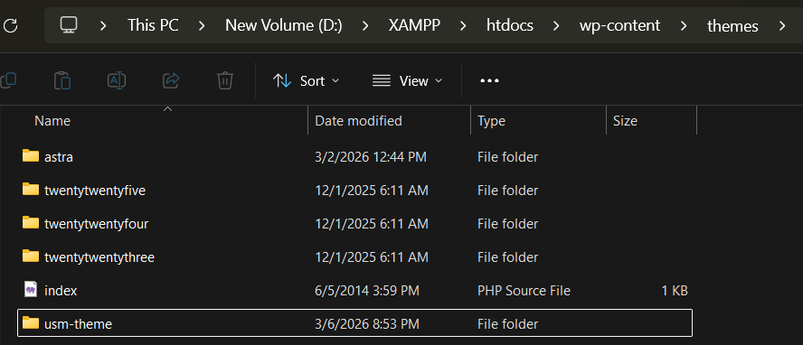

Am activat `WP_DEBUG` in `wp-config`.


**Pasul 2** — Crearea fișierelor obligatorii ale temei: 
Am creat `style.css` cu metadatele temei
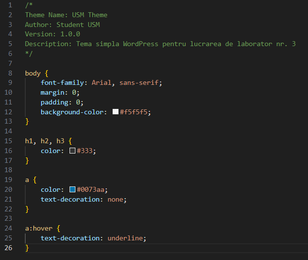

Am creat `index.php` cu structura HTML de bază.
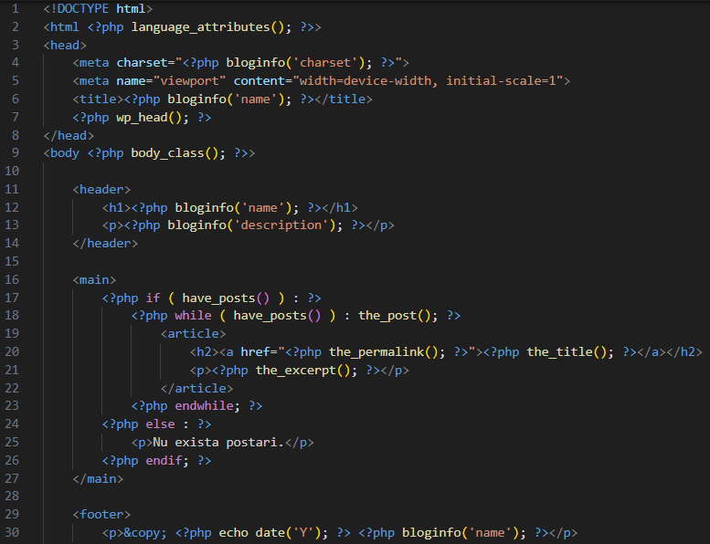

**Pasul 3** — Componente comune: 
Am creat `header.php` 
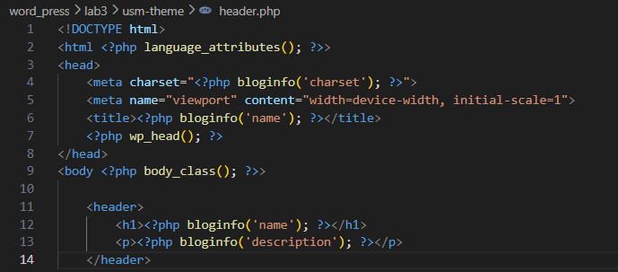

Am creat `footer.php`
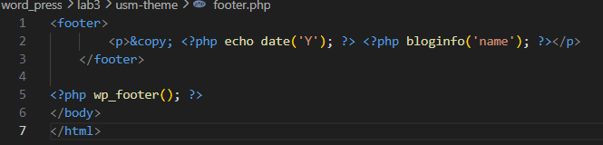

Le-am incluse în `index.php` cu `get_header()` / `get_footer()` + afișarea ultimelor 5 postări prin bucla WordPress.
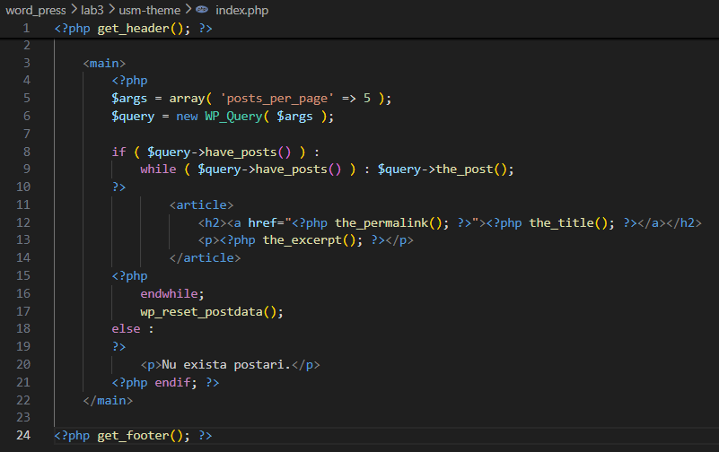

**Pasul 4** — Fișierul de funcții: 
Am creat `functions.php` cu funcția de încărcare a stilurilor prin `wp_enqueue_style()`.
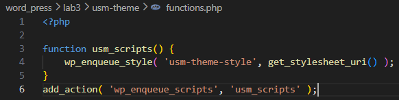

**Pasul 5** — Șabloane suplimentare: 
Am creat `single.php` pentru afisarea unei singure postari
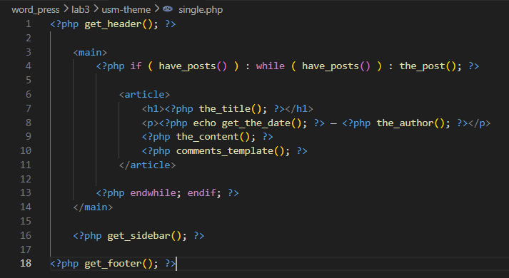

Am creat `page.php`pentru afisareapaginilor
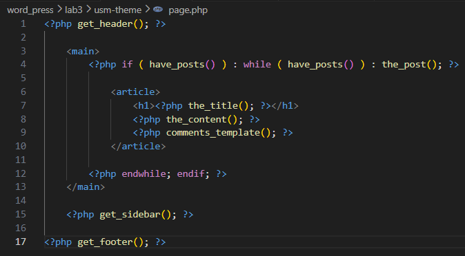

Am creat `sidebar.php` pentru bara laterala
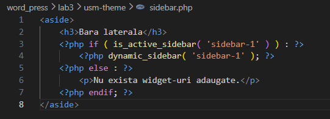

Am creat `comments.php`pentru afisarea comentariilor si l-am inclus in single.php si page.php
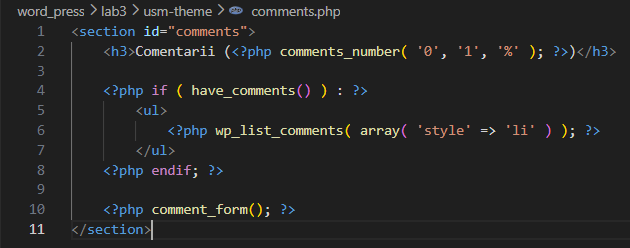

Am creat fisierul `archive.php` pentru arhivarea postarilor
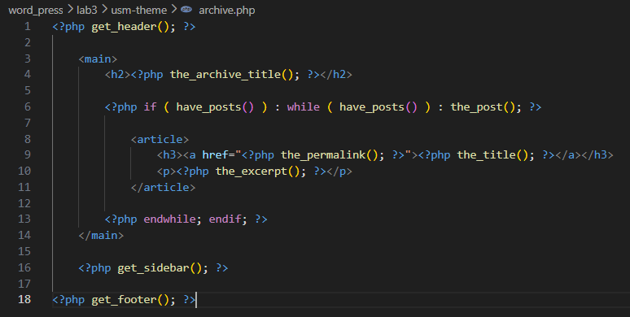

**Pasul 6** — Stilizare CSS pentru antet, subsol, conținut și bara laterală.
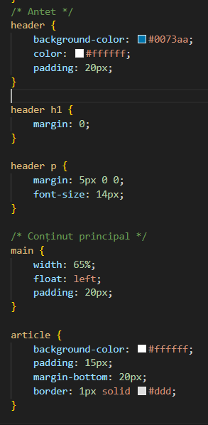

**Pasul 7** — Am adaugat `screenshot.png` (1200×900px) pentru previzualizarea temei.
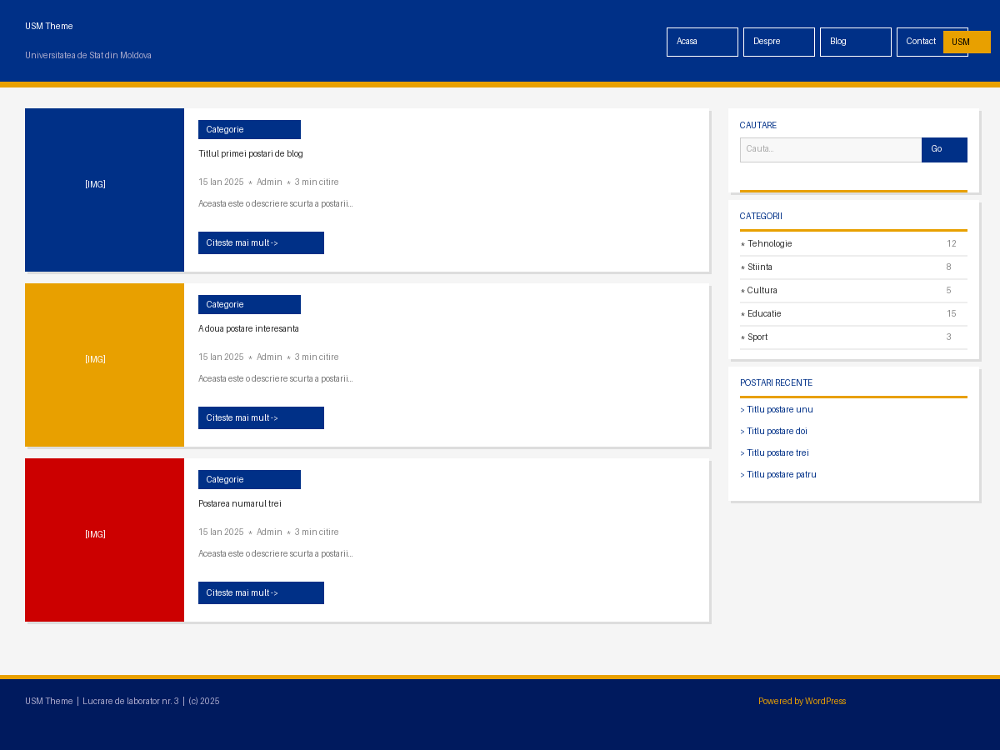

**Pasul 8** — Tema activată din **Appearance → Themes**.
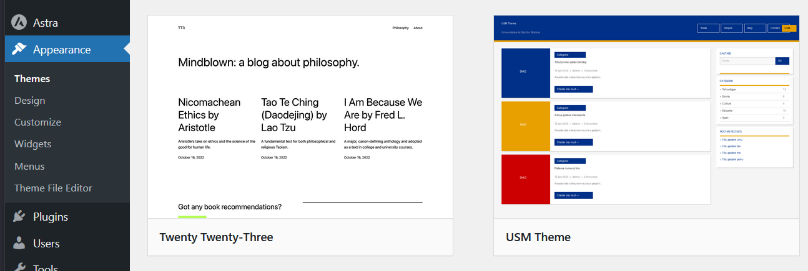

Site simplu de baza
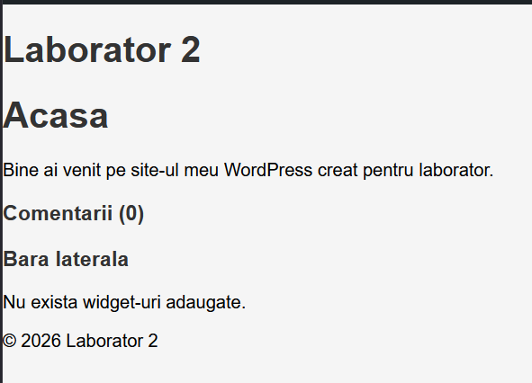

Site modificat
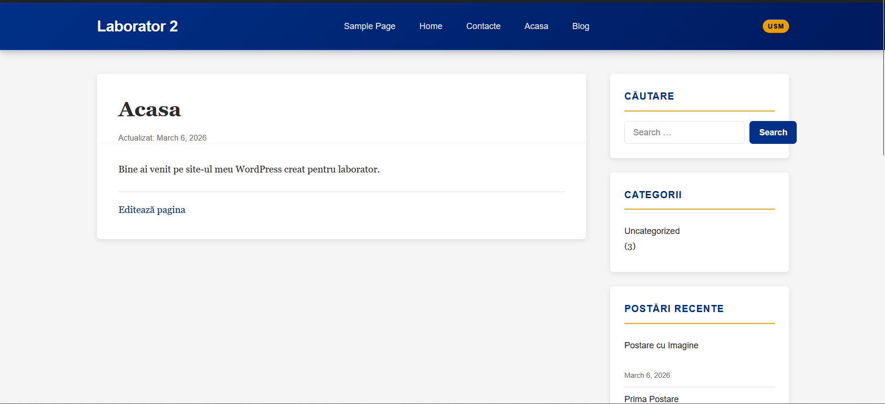

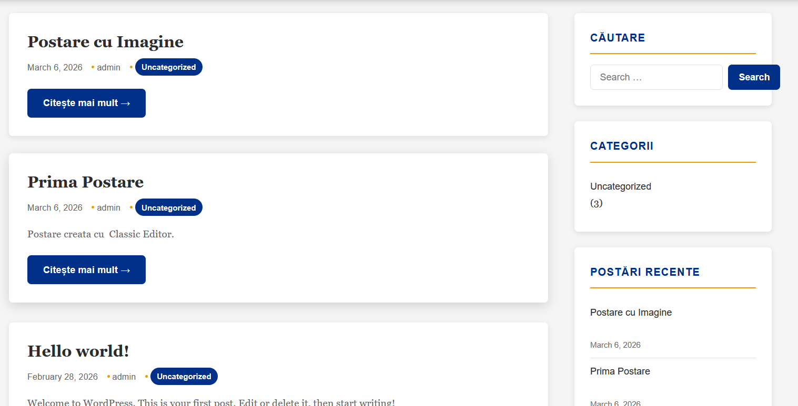

---

## 3. Răspunsuri la întrebările de control

**1. Care sunt cele două fișiere obligatorii pentru orice temă WordPress?**

- `style.css` — conține comentariul cu metadatele temei (`Theme Name`, `Author`, `Version` etc.). Fără el WordPress nu recunoaște directorul ca temă.
- `index.php` — șablonul fallback universal. Dacă WordPress nu găsește un șablon mai specific, folosește `index.php`.

**2. Cum se includ părțile comune ale șabloanelor?**

WordPress pune la dispoziție funcții dedicate:
```php
<?php get_header();  ?>  // include header.php
<?php get_footer();  ?>  // include footer.php
<?php get_sidebar(); ?>  // include sidebar.php
<?php comments_template(); ?>  // include comments.php
```
Aceste funcții sunt superioare unui simplu `include` PHP deoarece suportă teme copil, declanșează hooks WordPress și păstrează variabilele globale disponibile.

**3. Care este diferența dintre `index.php`, `single.php` și `page.php`?**

| Fișier | Când se folosește |
|--------|-------------------|
| `index.php` | Fallback universal — când niciun alt șablon nu se potrivește |
| `single.php` | O postare individuală de blog (`post_type = post`) |
| `page.php` | O pagină statică WordPress (`post_type = page`) |

`single.php` afișează metadate (autor, dată, etichete) și navigare prev/next. `page.php` nu afișează metadate de blog și permite șabloane personalizate. `index.php` este baza listei de postări și fallback-ul absolut.

**4. Care este rolul fișierului `functions.php` într-o temă?**

`functions.php` se încarcă automat de WordPress la fiecare cerere și are rolul de a:
- activa funcționalități prin `add_theme_support()` (imagini reprezentative, title-tag, HTML5)
- înregistra și încărca stiluri/scripturi prin `wp_enqueue_style()` / `wp_enqueue_script()`
- înregistra meniuri de navigare cu `register_nav_menus()`
- înregistra zone de widget-uri cu `register_sidebar()`
- extinde funcționalitatea prin hooks (`add_action`, `add_filter`)

Nu produce output HTML direct — funcționează ca un plugin atașat temei.

---

## 6. Surse utilizate

1. WordPress Developer Resources — Theme Handbook: https://developer.wordpress.org/themes/
2. WordPress — Template Hierarchy: https://developer.wordpress.org/themes/basics/template-hierarchy/
3. WordPress — wp_enqueue_style(): https://developer.wordpress.org/reference/functions/wp_enqueue_style/
4. WordPress — The Loop: https://developer.wordpress.org/themes/basics/the-loop/
5. WordPress — register_sidebar(): https://developer.wordpress.org/reference/functions/register_sidebar/
6. WordPress — WP_Query: https://developer.wordpress.org/reference/classes/wp_query/
7. MDN Web Docs — CSS Custom Properties: https://developer.mozilla.org/en-US/docs/Web/CSS/Using_CSS_custom_properties