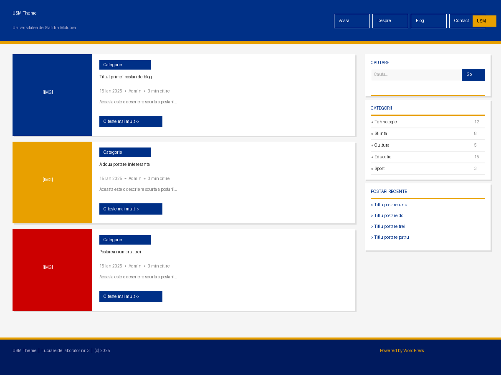

# 🎓 USM Theme — Lucrare de laborator nr. 3

> **Temă WordPress personalizată** dezvoltată ca lucrare de laborator la disciplina *Tehnologii Web* —  
> Universitatea de Stat din Moldova, Facultatea de Matematică și Informatică.



---

## 📋 Cuprins

1. [Descrierea lucrării de laborator](#descrierea-lucrarii)
2. [Instrucțiuni pentru rularea proiectului](#instructiuni-rulare)
3. [Structura temei](#structura-temei)
4. [Documentație pentru temă](#documentatie)
5. [Exemple de utilizare](#exemple-utilizare)
6. [Răspunsuri la întrebările de control](#intrebari-control)
7. [Surse utilizate](#surse)

---

## 📖 Descrierea lucrării de laborator <a name="descrierea-lucrarii"></a>

### Scopul lucrării

Lucrarea de laborator nr. 3 urmărește:
- Crearea unei teme WordPress personalizate de la zero
- Înțelegerea structurii minime a unei teme WordPress
- Aplicarea principiilor de funcționare ale șabloanelor WordPress (Template Hierarchy)
- Implementarea componentelor comune: header, footer, sidebar, comentarii

### Etapele principale

| Pas | Descriere | Fișiere create |
|-----|-----------|----------------|
| 1 | Pregătirea mediului WordPress | — |
| 2 | Fișierele obligatorii | `style.css`, `index.php` |
| 3 | Componente comune | `header.php`, `footer.php` |
| 4 | Fișierul de funcții | `functions.php` |
| 5 | Șabloane suplimentare | `single.php`, `page.php`, `sidebar.php`, `comments.php`, `archive.php` |
| 6 | Stilizare | CSS în `style.css` |
| 7 | Captură ecran | `screenshot.png` |

### Aspecte interesante ale implementării

**Bucla WordPress personalizată** — în `index.php` am folosit `WP_Query` cu `posts_per_page: 5` pentru a afișa exact ultimele 5 postări pe pagina principală, separat de bucla nativă folosită când există o pagină dedicată blogului:

```php
$args = array(
    'posts_per_page' => 5,
    'post_status'    => 'publish',
);
$latest_posts = new WP_Query( $args );
```

**Template Hierarchy** — tema respectă ierarhia șabloanelor WordPress: când WordPress afișează o postare individuală, caută mai întâi `single-{post-type}.php`, apoi `single.php`, iar la final `index.php`. Același principiu se aplică pentru `archive.php`, `page.php` etc.

**wp_enqueue_style() vs link direct** — stilurile se înregistrează corect prin `wp_enqueue_scripts`, ceea ce permite altor plugin-uri să gestioneze dependențele și să evite conflicte.

**Sidebar cu fallback** — `sidebar.php` afișează widget-uri dinamice dacă sidebar-ul este activ, sau widget-uri statice implicite (categorii, postări recente, arhive) dacă nu s-au adăugat widget-uri din panou.

**Comentarii cu callback** — `comments.php` folosește un callback personalizat `usm_comment_callback()` pentru a controla complet HTML-ul fiecărui comentariu, inclusiv avatar, meta și buton de răspuns.

---

## 🚀 Instrucțiuni pentru rularea proiectului <a name="instructiuni-rulare"></a>

### Cerințe preliminare

- **PHP** ≥ 7.4
- **WordPress** ≥ 5.0 (testat pe 6.4)
- **MySQL/MariaDB** ≥ 5.6
- Un server local: **XAMPP**, **WAMP**, **Local by Flywheel** sau **Laragon**

### Instalare pas cu pas

#### 1. Instalare WordPress local

```bash
# Descarcă WordPress de pe wordpress.org
# Extrage în htdocs/ (XAMPP) sau www/ (WAMP)
# Creează baza de date MySQL:
CREATE DATABASE wordpress_db CHARACTER SET utf8mb4 COLLATE utf8mb4_unicode_ci;
```

Urmează wizard-ul de instalare la `http://localhost/wordpress/`.

#### 2. Activează modul de depanare

În `wp-config.php`, adaugă sau modifică:

```php
define( 'WP_DEBUG', true );
define( 'WP_DEBUG_LOG', true );
define( 'WP_DEBUG_DISPLAY', false );
```

#### 3. Instalare temă

**Varianta A — Git clone (recomandat):**

```bash
cd /path/to/wordpress/wp-content/themes/
git clone https://github.com/<username>/usm-theme.git usm-theme
```

**Varianta B — Upload manual:**

1. Descarcă arhiva ZIP a repository-ului
2. În panoul WordPress: **Appearance → Themes → Add New → Upload Theme**
3. Selectează fișierul ZIP și apasă **Install Now**

**Varianta C — Copiere directă:**

```bash
cp -r usm-theme/ /path/to/wordpress/wp-content/themes/
```

#### 4. Activare temă

1. Accesează **wp-admin → Appearance → Themes**
2. Găsește **USM Theme** și apasă **Activate**

#### 5. Configurare recomandată

```
wp-admin → Settings → Permalinks → Post name  (/sample-post/)
wp-admin → Appearance → Menus → Creează meniu → atribuie la "Meniu principal"
wp-admin → Appearance → Widgets → Adaugă widget-uri în "Bara laterală principală"
```

---

## 🗂️ Structura temei <a name="structura-temei"></a>

```
usm-theme/
│
├── style.css          # Metadate temă + toate stilurile CSS
├── index.php          # Șablon principal (lista postări, fallback)
├── header.php         # Antetul site-ului (DOCTYPE → începutul conținutului)
├── footer.php         # Subsolul site-ului + wp_footer()
├── sidebar.php        # Bara laterală cu widget-uri
├── single.php         # Postare individuală de blog
├── page.php           # Pagină statică WordPress
├── archive.php        # Arhive (categorie, etichetă, dată, autor)
├── search.php         # Rezultate căutare
├── 404.php            # Pagina de eroare 404
├── comments.php       # Sistem comentarii + formular
├── functions.php      # Funcții temă, hooks, enqueue scripts
├── screenshot.png     # Previzualizare temă (1200×900px)
│
└── js/
    └── navigation.js  # Script navigare responsivă (opțional)
```

### Ierarhia șabloanelor WordPress (Template Hierarchy)

```
Pagina principală    → index.php
Postare individuală → single.php → index.php
Pagină statică      → page.php  → index.php
Arhivă categorie    → archive.php → index.php
Căutare             → search.php → index.php
404                 → 404.php   → index.php
```

---

## 📚 Documentație pentru temă <a name="documentatie"></a>

### `style.css` — Metadate și stiluri

Primul fișier obligatoriu. Comentariul de la început conține metadatele temei:

```css
/*
Theme Name: USM Theme
Theme URI:  https://github.com/...
Author:     Student USM
Version:    1.0.0
...
*/
```

Tema folosește **CSS Custom Properties** (variabile) pentru paleta de culori:

```css
:root {
    --primary-color: #003087;   /* Albastru USM */
    --secondary-color: #e8a000; /* Galben accent */
    --accent-color: #cc0000;    /* Roșu accent */
}
```

### `functions.php` — Funcționalitățile principale

Registrare funcționalități în `after_setup_theme`:

```php
function usm_theme_setup() {
    add_theme_support( 'post-thumbnails' );
    add_theme_support( 'title-tag' );
    add_theme_support( 'html5', array( 'search-form', 'comment-form', ... ) );
    register_nav_menus( array(
        'primary' => 'Meniu principal',
        'footer'  => 'Meniu subsol',
    ) );
}
add_action( 'after_setup_theme', 'usm_theme_setup' );
```

Înregistrare stiluri cu `wp_enqueue_style()`:

```php
function usm_scripts() {
    wp_enqueue_style( 'usm-theme-style', get_stylesheet_uri(), array(), '1.0.0' );
    wp_enqueue_style( 'usm-google-fonts', 'https://fonts.googleapis.com/...', array(), null );
}
add_action( 'wp_enqueue_scripts', 'usm_scripts' );
```

Înregistrare sidebar:

```php
function usm_widgets_init() {
    register_sidebar( array(
        'name'          => 'Bara laterală principală',
        'id'            => 'sidebar-1',
        'before_widget' => '<section id="%1$s" class="widget %2$s">',
        'after_widget'  => '</section>',
        'before_title'  => '<h3 class="widget-title">',
        'after_title'   => '</h3>',
    ) );
}
add_action( 'widgets_init', 'usm_widgets_init' );
```

### Includerea componentelor comune

```php
<?php get_header();  ?>   <!-- include header.php  -->
<?php get_footer();  ?>   <!-- include footer.php  -->
<?php get_sidebar(); ?>   <!-- include sidebar.php -->
<?php comments_template(); ?>  <!-- include comments.php -->
```

### Bucla WordPress

```php
if ( have_posts() ) :
    while ( have_posts() ) : the_post();
        the_title( '<h2>', '</h2>' );
        the_excerpt();
        the_permalink();
    endwhile;
endif;
```

---

## 💡 Exemple de utilizare a temei <a name="exemple-utilizare"></a>

### Exemplu 1 — Adăugare widget în sidebar

```
wp-admin → Appearance → Widgets
→ Trage "Recent Posts" în "Bara laterală principală"
→ Configurează numărul de postări → Save
```

### Exemplu 2 — Creare meniu de navigare

```
wp-admin → Appearance → Menus → Create New Menu
Nume: "Meniu principal"
→ Adaugă pagini: Acasă, Despre noi, Blog, Contact
→ Menu Settings: bifează "Primary Menu"
→ Save Menu
```

### Exemplu 3 — Personalizare culori (în style.css)

```css
:root {
    --primary-color: #8B0000;    /* Roșu university */
    --secondary-color: #FFD700;  /* Galben gold */
}
```

### Exemplu 4 — Adăugare funcționalitate în functions.php

```php
// Adaugă numărul de cuvinte la finalul fiecărei postări
function usm_add_word_count( $content ) {
    if ( is_single() ) {
        $count = str_word_count( strip_tags( $content ) );
        $content .= '<p class="word-count">Cuvinte: ' . $count . '</p>';
    }
    return $content;
}
add_filter( 'the_content', 'usm_add_word_count' );
```

### Exemplu 5 — Șablon personalizat pentru pagini

Creează fișierul `page-contact.php`:

```php
<?php
/*
 * Template Name: Pagina Contact
 */
get_header();
// conținut personalizat
get_footer();
```

Apoi în editor, la crearea paginii, selectează **Template: Pagina Contact**.

---

## ❓ Răspunsuri la întrebările de control <a name="intrebari-control"></a>

### 1. Care sunt cele două fișiere obligatorii pentru orice temă WordPress?

Cele două fișiere **strict obligatorii** sunt:

- **`style.css`** — conține comentariul cu metadatele temei (`Theme Name`, `Version`, `Author` etc.). Fără acest comentariu, WordPress nu recunoaște directorul ca temă validă.
- **`index.php`** — șablonul de ultimă instanță (fallback). Dacă WordPress nu găsește un alt șablon mai specific (ex. `single.php`, `archive.php`), va folosi `index.php`. Este singurul fișier PHP obligatoriu.

Toate celelalte fișiere (`header.php`, `footer.php`, `functions.php` etc.) sunt opționale, deși esențiale pentru o temă funcțională.

### 2. Cum se includ părțile comune ale șabloanelor (header, footer, sidebar)?

WordPress oferă funcții dedicate pentru includerea componentelor comune:

```php
<?php get_header();  ?>  // → caută şi include header.php
<?php get_footer();  ?>  // → caută şi include footer.php
<?php get_sidebar(); ?>  // → caută şi include sidebar.php

// Variante cu sufix pentru șabloane multiple:
<?php get_sidebar( 'shop' ); ?>  // → include sidebar-shop.php
<?php get_header( 'mobile' ); ?> // → include header-mobile.php

// Pentru comentarii:
<?php comments_template(); ?>    // → include comments.php

// Generic (pentru orice șablon):
<?php get_template_part( 'template-parts/content', get_post_format() ); ?>
```

Aceste funcții sunt superioare unui simplu `include` / `require` PHP deoarece:
1. Caută fișierul în tema copil înainte de tema părinte (child theme support)
2. Declanșează hooks WordPress (`get_header`, `get_footer` etc.)
3. Asigură că `$wp_query` și variabilele globale sunt disponibile

### 3. Care este diferența dintre `index.php`, `single.php` și `page.php`?

| Fișier | Când se folosește | Tip conținut |
|--------|-------------------|--------------|
| `index.php` | Fallback universal — când niciun alt șablon nu se potrivește | Orice |
| `single.php` | O **postare de blog** individuală (`post_type = 'post'`) | Post |
| `page.php` | O **pagină statică** WordPress (`post_type = 'page'`) | Page |

**Diferențe practice:**
- `single.php` afișează de obicei metadate (autor, dată, categorie, etichete), navigare la postările anterioare/următoare și comentarii.
- `page.php` nu afișează în general metadate de tip blog, dar poate afișa subpagini și permite atribuirea de șabloane personalizate.
- `index.php` servește ca bază pentru lista de postări și ca fallback absolut în ierarhia șabloanelor.

**Ierarhia completă pentru o postare:** `single-post.php` → `single.php` → `singular.php` → `index.php`

### 4. Care este rolul fișierului `functions.php` într-o temă?

`functions.php` este "creierul" temei — un fișier PHP care se încarcă automat de WordPress la fiecare cerere, atât în frontend cât și în wp-admin. Rolurile sale principale:

**a) Activarea funcționalităților WordPress** prin `add_theme_support()`:
```php
add_theme_support( 'post-thumbnails' );  // imagini reprezentative
add_theme_support( 'title-tag' );        // titlu dinamic în <head>
add_theme_support( 'html5', [...] );     // markup HTML5
```

**b) Înregistrarea și încărcarea stilurilor/scripturilor** — singura metodă corectă:
```php
wp_enqueue_style( 'usm-style', get_stylesheet_uri() );
wp_enqueue_script( 'usm-nav', get_template_directory_uri() . '/js/nav.js' );
```

**c) Înregistrarea meniurilor de navigare:**
```php
register_nav_menus( array( 'primary' => 'Meniu principal' ) );
```

**d) Înregistrarea sidebar-urilor (widget areas):**
```php
register_sidebar( array( 'name' => 'Sidebar', 'id' => 'sidebar-1' ) );
```

**e) Extinderea funcționalității** prin hooks (actions și filters):
```php
add_filter( 'excerpt_length', function() { return 30; } );
add_action( 'wp_footer', 'usm_custom_footer_script' );
```

**Important:** `functions.php` nu produce output HTML direct — funcționează ca un plugin atașat temei.

---

## 📚 Lista surselor utilizate <a name="surse"></a>

1. **WordPress Developer Resources — Theme Handbook**  
   https://developer.wordpress.org/themes/

2. **WordPress Developer Resources — Template Hierarchy**  
   https://developer.wordpress.org/themes/basics/template-hierarchy/

3. **WordPress Codex — wp_enqueue_style()**  
   https://developer.wordpress.org/reference/functions/wp_enqueue_style/

4. **WordPress Codex — register_sidebar()**  
   https://developer.wordpress.org/reference/functions/register_sidebar/

5. **WordPress Codex — WP_Query**  
   https://developer.wordpress.org/reference/classes/wp_query/

6. **WordPress Codex — The Loop**  
   https://developer.wordpress.org/themes/basics/the-loop/

7. **MDN Web Docs — CSS Custom Properties**  
   https://developer.mozilla.org/en-US/docs/Web/CSS/Using_CSS_custom_properties

8. **WordPress Codex — add_theme_support()**  
   https://developer.wordpress.org/reference/functions/add_theme_support/

9. **WordPress Theme Review Handbook**  
   https://make.wordpress.org/themes/handbook/review/

10. **CSS-Tricks — A Complete Guide to Flexbox**  
    https://css-tricks.com/snippets/css/a-guide-to-flexbox/

11. **CSS-Tricks — A Complete Guide to Grid**  
    https://css-tricks.com/snippets/css/complete-guide-grid/

12. **WordPress Codex — comments_template()**  
    https://developer.wordpress.org/reference/functions/comments_template/

---

## 🔗 Repository Git

> Tema este disponibilă la: **https://github.com/\<username\>/usm-theme**

---

## 📝 Note suplimentare

- Tema este **WCAG 2.1 AA** compatibilă — include `screen-reader-text`, atribute `aria-label` și focus vizibil
- Design **responsive** — funcționează pe desktop, tabletă și mobil
- Testat pe **WordPress 6.4** cu PHP 8.1
- Codul respectă **WordPress Coding Standards** (WPCS)
- Tema **nu** colectează date personale și este GDPR-friendly

---

*Lucrare realizată în cadrul cursului Tehnologii Web — Universitatea de Stat din Moldova, 2025*
