# Lucrare de laborator nr. 4 — USM Notes Plugin

Plugin WordPress educațional care adaugă o secțiune „Notițe" cu priorități și date de reamintire.

---

## 1. Instrucțiuni pentru rularea proiectului

**Cerințe:** PHP ≥ 7.4, WordPress ≥ 5.0, server local (XAMPP / WAMP / Laragon).

**Pași:**

1. Copiază folderul `usm-notes` în `wp-content/plugins/`.
2. În panoul WordPress accesează **Plugins → Installed Plugins**.
3. Găsește **USM Notes** și apasă **Activate**.
4. În meniul din stânga apare secțiunea **Notite**.

---

## 2. Descrierea lucrării de laborator

**Scopul:** Crearea unui plugin WordPress care implementează un CPT, o taxonomie personalizată, metadate cu metabox și un shortcode pentru afișarea datelor pe site.

**Pașii realizați:**

**Pasul 1** — Pregătirea mediului: 

Am creat directorul `usm-notes` în `wp-content/plugins/`

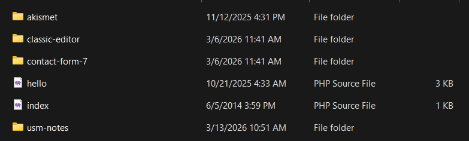

Am activat `WP_DEBUG`

**Pasul 2** 

Am creat fișierul principal `usm-notes.php` cu metadatele pluginului.

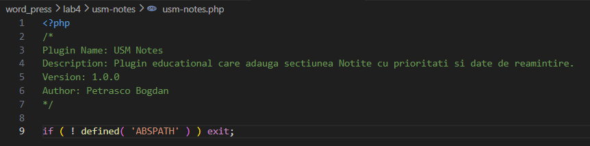

Am verificat ca este vizibil in pagina plugins

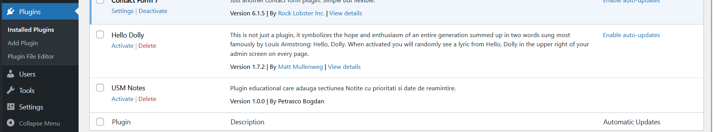

Am activat pluginul

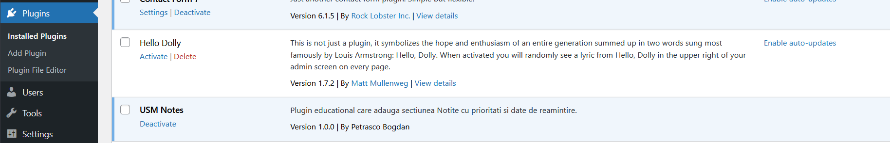

**Pasul 3** 

Am adaugat o functie pentru inregistrarea CPT „Notite" cu `register_post_type()`, cu suport pentru titlu, editor, autor, miniatură și pagină de arhivă.

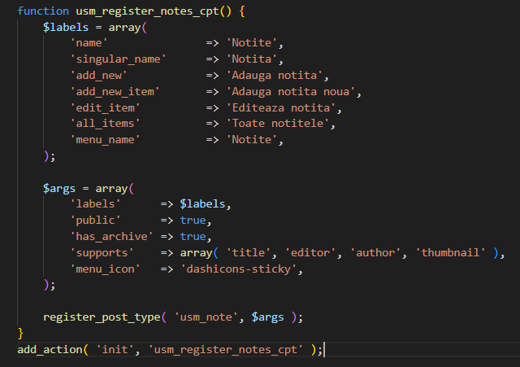

**Pasul 4** 

Am adaugat o functie pentru inregistrarea taxonomiei „Prioritate" cu `register_taxonomy()`, legată de CPT-ul „Notite".

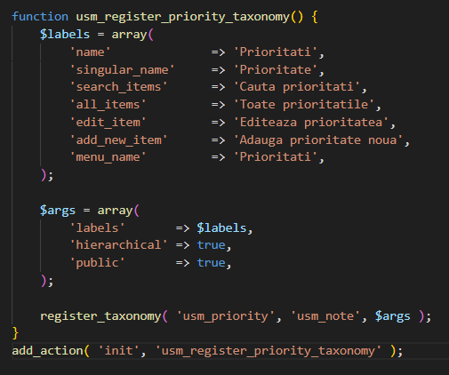

**Pasul 5** 

Am creat o funcție pentru adăugarea unui metabox în editorul CPT „Notițe” folosind add_meta_box()

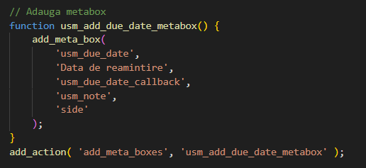

Conținutul metabox-ului (câmpul de dată)

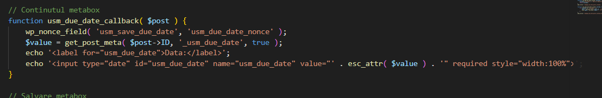

Salvarea datei cu save_post, verificare nonce si validarea datei

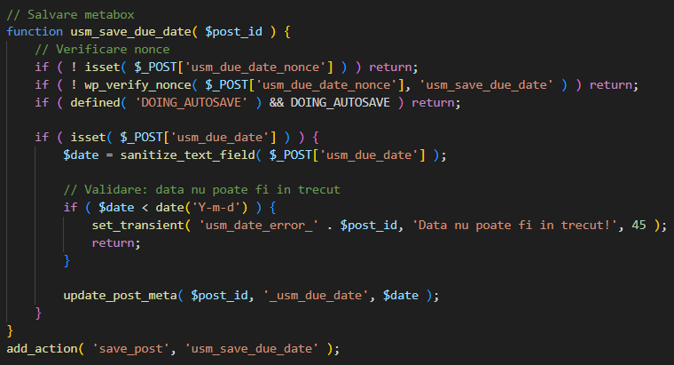

Afișarea mesajului de eroare

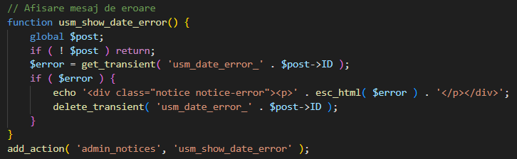

Am afișat data de reamintire în lista postărilor CPT „Notițe” din admin.

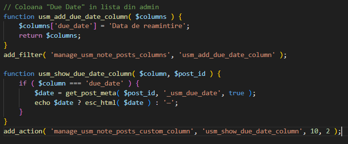

**Pasul 6**

Am creat o funcție pentru procesarea shortcode-ului `[usm_notes priority="X" before_date="YYYY-MM-DD"]`

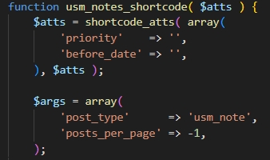

Am adăugat filtrele după prioritate și dată folosind `tax_query` și `meta_query` în `WP_Query`

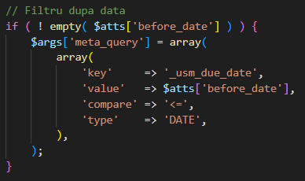

Am înregistrat shortcode-ul folosind `add_shortcode()` și am gestionat cazul când nu există notițe

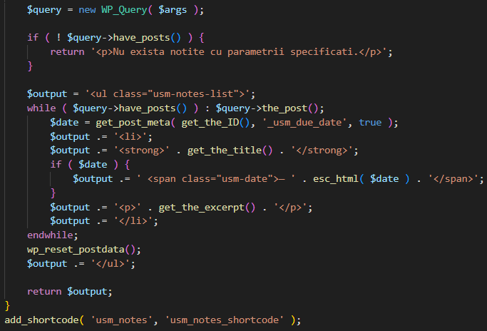

Am adăugat stiluri pentru afișarea listei de notițe

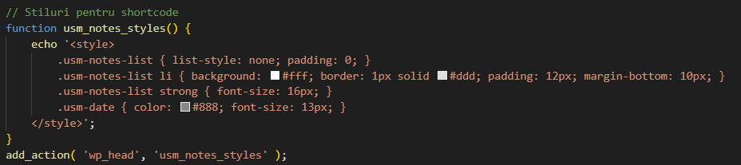

**Pasul 7** 

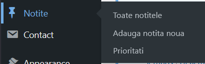

Am adăugat 5-6 notițe cu priorități și date de reamintire diferite

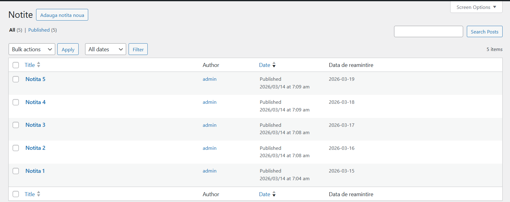

Am creat pagina „All Notes" cu shortcode-urile necesare

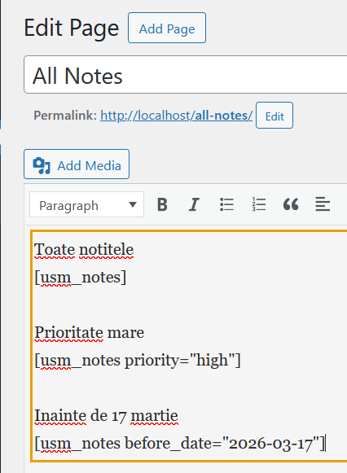

Am verificat afișarea corectă pe frontend

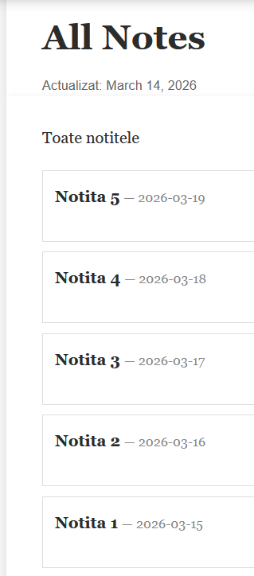

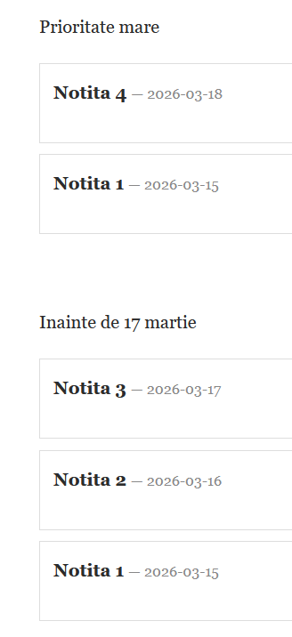

---

## 3. Răspunsuri la întrebările de control

**1. Diferența dintre taxonomie și metacâmp:**

Taxonomia grupează postările în termeni reutilizabili și permite filtrare și arhivare. Metacâmpul stochează o valoare unică per postare.

- **Taxonomie** e potrivită când mai multe postări împart aceeași valoare — ex. prioritatea (High/Medium/Low), unde vrei să filtrezi toate notițele cu prioritate mare.
- **Metacâmp** e potrivit pentru valori unice per postare — ex. data de reamintire, care este diferită pentru fiecare notiță.

**2. De ce este necesar nonce:**

Nonce este un token de securitate generat de WordPress care verifică că cererea de salvare vine dintr-un formular legitim al site-ului, nu dintr-un atac CSRF. Fără verificarea nonce, un atacator ar putea trimite o cerere falsă care modifică sau șterge metadatele postărilor.

**3. Cei mai importanți parametri ai register_post_type() și register_taxonomy():**

- `public` — controlează dacă CPT/taxonomia apare pe frontend și în admin. Fără `true` nu este vizibil nicăieri.
- `has_archive` — activează o pagină de arhivă pentru CPT (ex. `/usm_note/`), esențial pentru ca utilizatorii să poată naviga la toate postările.
- `labels` — definește textele afișate în interfața de admin (Add New, Edit, All Items etc.). Fără labels corecte interfața admin este confuză pentru utilizator.

---

## 6. Surse utilizate

1. WordPress Developer Resources — Plugin Handbook: https://developer.wordpress.org/plugins/
2. WordPress — register_post_type(): https://developer.wordpress.org/reference/functions/register_post_type/
3. WordPress — register_taxonomy(): https://developer.wordpress.org/reference/functions/register_taxonomy/
4. WordPress — add_meta_box(): https://developer.wordpress.org/reference/functions/add_meta_box/
5. WordPress — add_shortcode(): https://developer.wordpress.org/reference/functions/add_shortcode/
6. WordPress — Nonces: https://developer.wordpress.org/apis/security/nonces/
7. WordPress — WP_Query: https://developer.wordpress.org/reference/classes/wp_query/

---
