# Lucrare de laborator nr. 5 — Securitatea WordPress

---

## 1. Instrucțiuni pentru rularea proiectului

**Cerințe:** WordPress instalat local, acces administrator, phpMyAdmin.

**Pași:**
1. Accesează panoul de administrare WordPress.
2. Instalează pluginul **All In One WP Security & Firewall** din Plugins → Add New.
3. Urmează configurările descrise mai jos.

---

## 2. Descrierea lucrării de laborator

**Scopul:** Consolidarea practicilor de securitate WordPress: roluri, actualizări, hardening, configurare AIOS, testare brute-force și backup.

**Pașii realizați:**

**Pasul 1** 

Am activat `WP_DEBUG` în `wp-config.php`

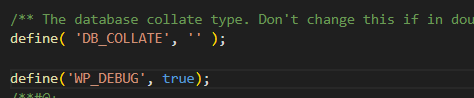

**Pasul 2** 

Am creat utilizator de test cu rolul Author și am verificat parole complexe

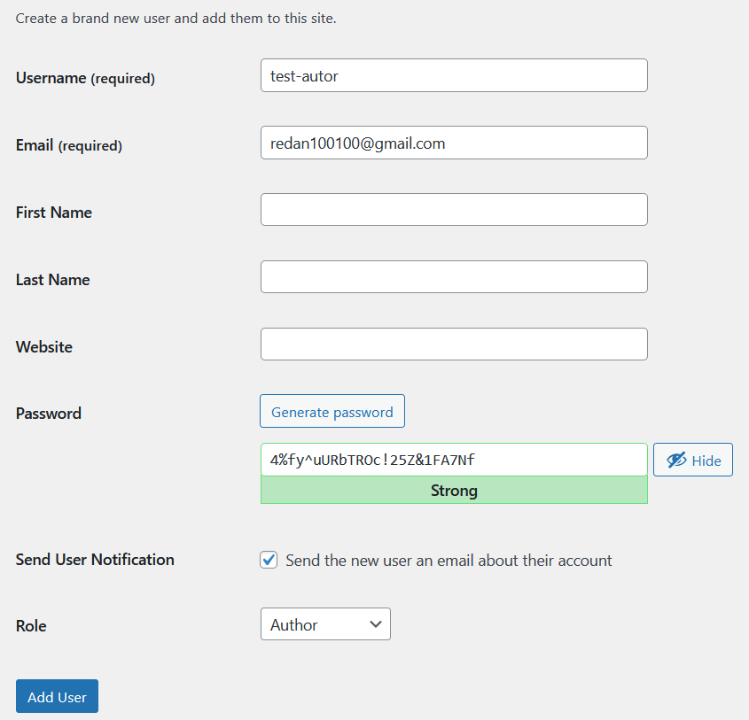

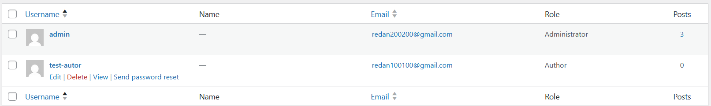

**Pasul 3** 

Am verificat și aplicat toate actualizările disponibile. 

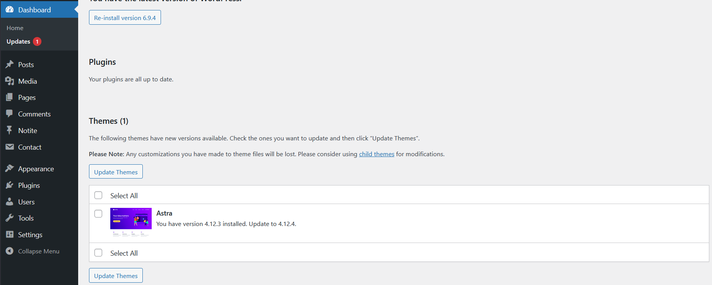

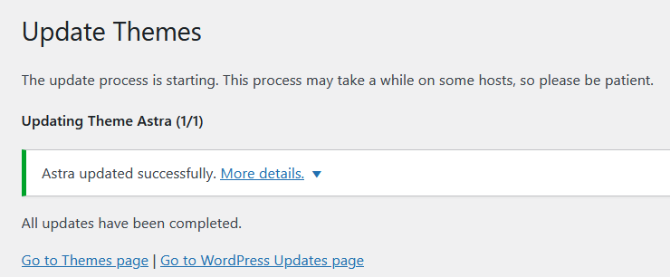

Am activat `WP_AUTO_UPDATE_CORE`pentru actualizari automate.

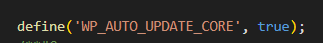

**Pasul 4** 

Am adăugat `DISALLOW_FILE_EDIT` în `wp-config.php` pentru a dezactiva editarea fisierelor din panoul de administrare.

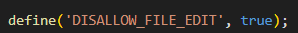

Am setat permisiuni 755/644.

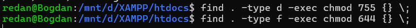

Am protejat `wp-config.php` prin `.htaccess`.

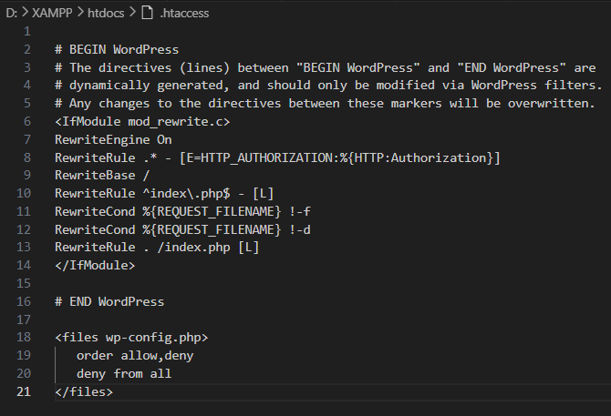

**Pasul 5** 

Am instalat și am configurat AIOS:

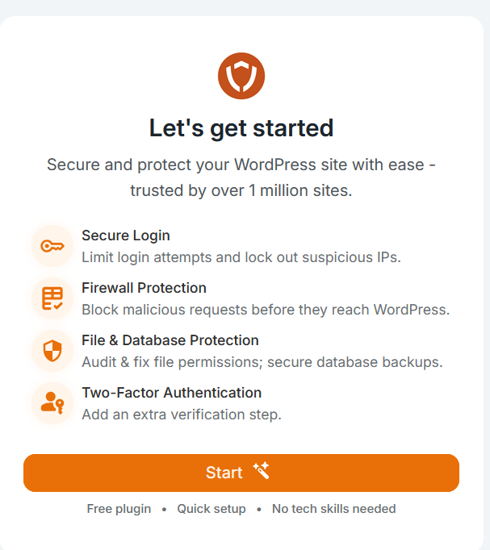

Login Lockdown (5 încercări, 15 min, 30 min blocare)

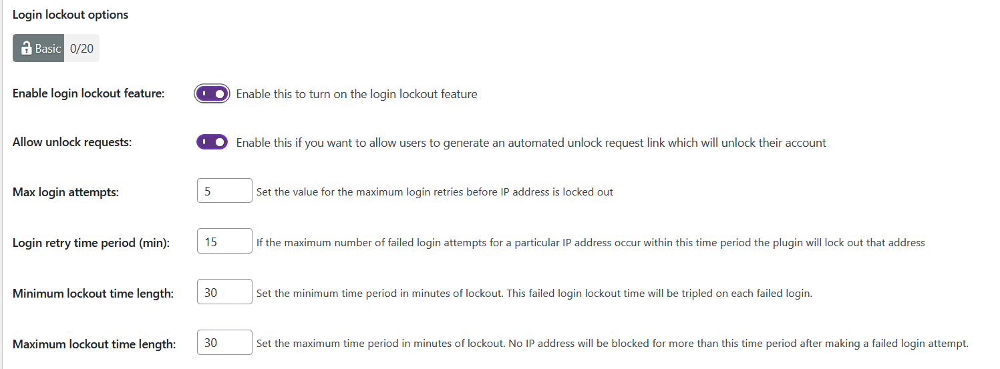

Force Logout la 24h

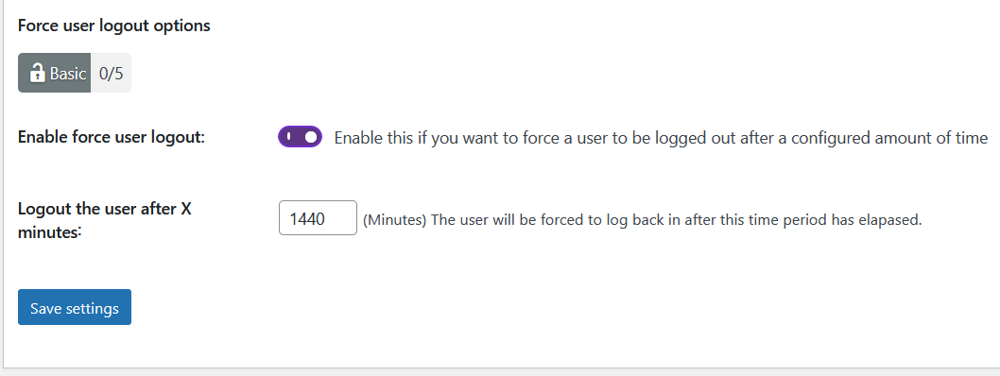

Am schimbat numele admin la usm-admin

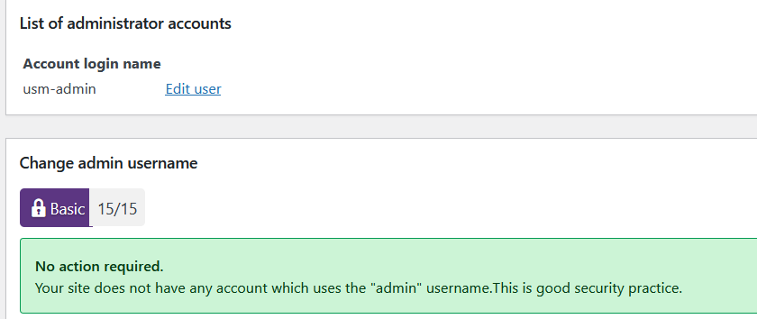

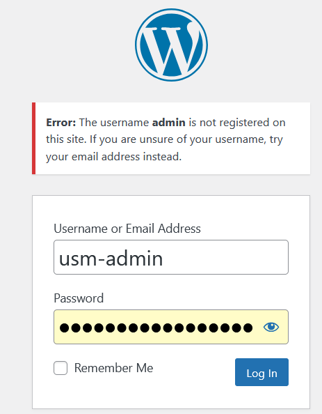

Am activat manual approval

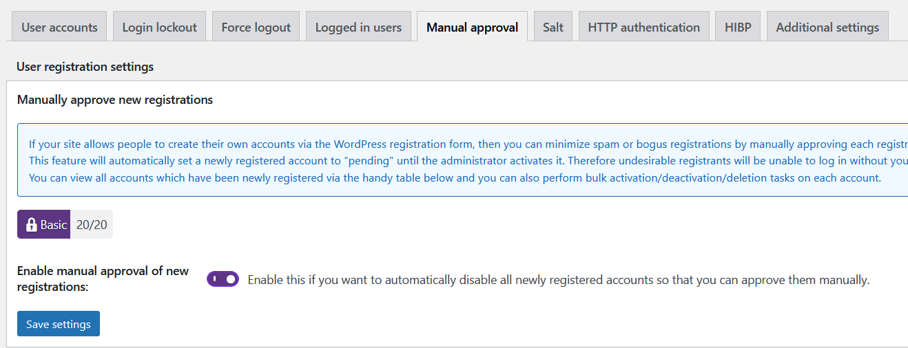

File security

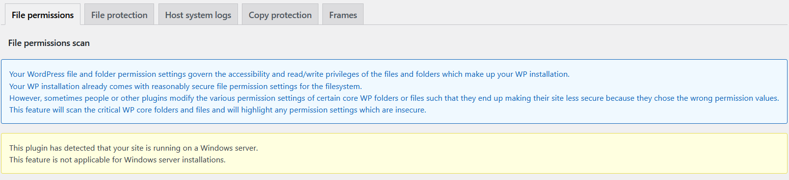

Basic Firewall + protecție XSS + Bad Query Strings

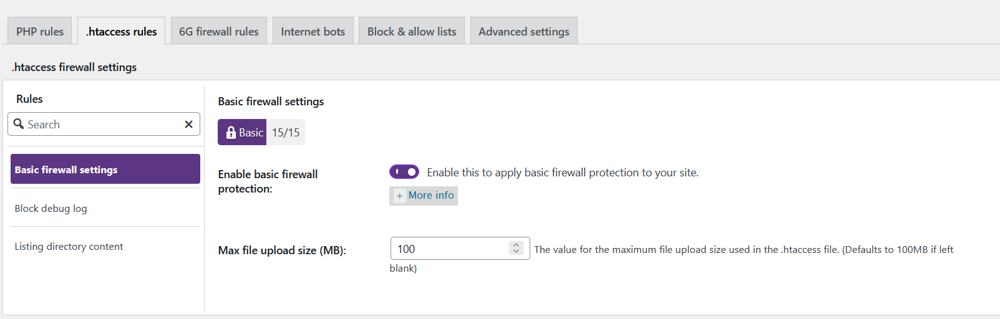

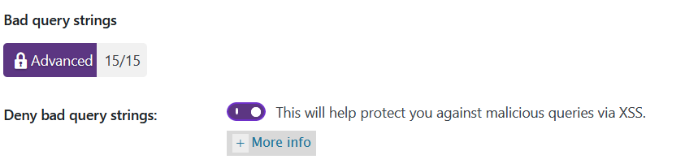

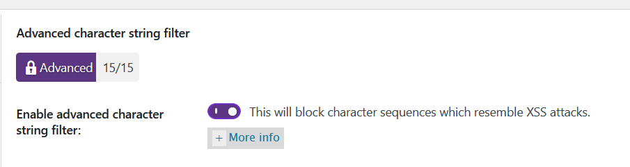

Brute Force

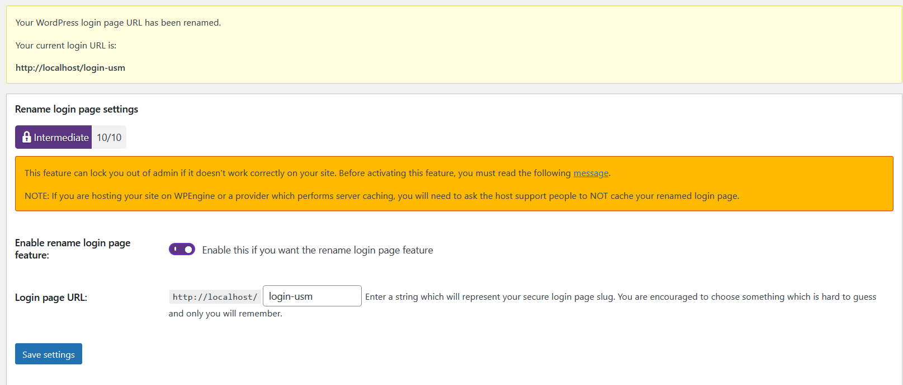

File Change Detection activat cu notificări email

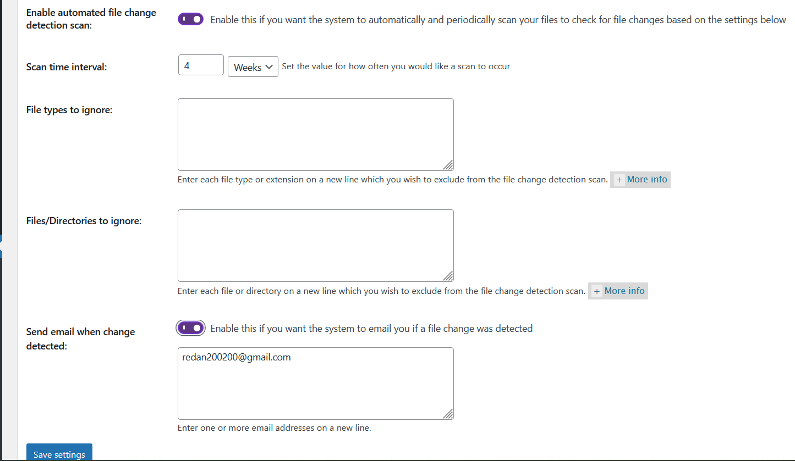

Database Backup creat și salvat

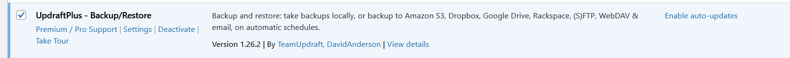

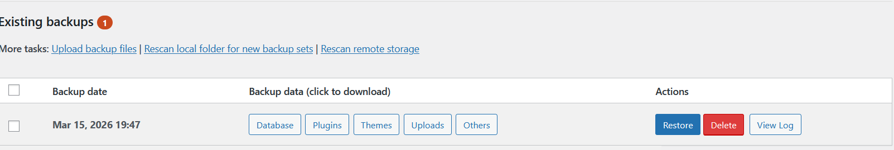

**Pasul 6** 

Am testat protecția brute-force: 6 încercări greșite → IP blocat

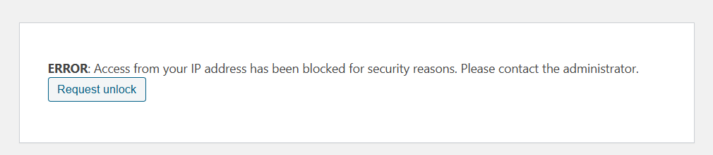

IP-ul blocat vizibil în dashboard AIOS, deblocat după verificare

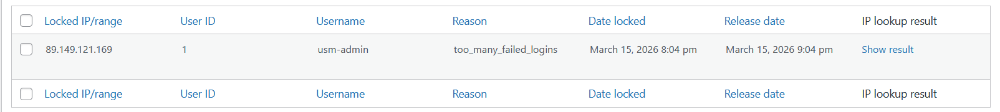

**Pasul 7** 

Am sters 4 notite, am lasat doar notita 5

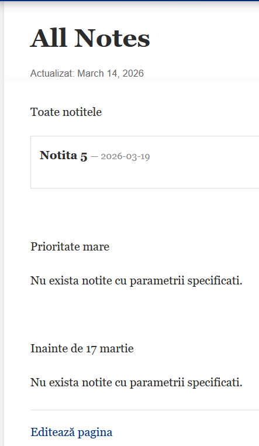

Am facut restore si observam ca au revenit notitele

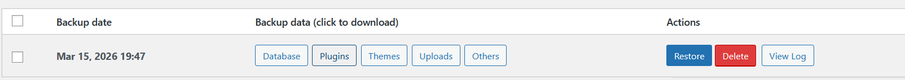

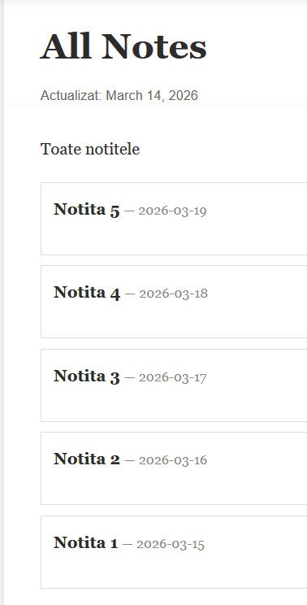

---

## 3. Răspunsuri la întrebările de control

**1. De ce DISALLOW_FILE_EDIT și permisiunile corecte pe wp-config.php reduc riscul post-exploit?**

`DISALLOW_FILE_EDIT` dezactivează editorul de fișiere din admin — chiar dacă un atacator obține acces la panou, nu poate injecta cod malițios în fișierele temei sau pluginurilor. Permisiunile corecte și blocul `deny from all` în `.htaccess` împiedică accesul direct la `wp-config.php` prin HTTP, protejând credențialele bazei de date chiar dacă serverul web este parțial compromis.

**2. Ce setări ai ales pentru Login Lockdown/Firewall și de ce?**

Am ales Max Login Attempts: 5, Retry Period: 15 min, Lockout: 30 min. Echilibrul permite unui utilizator legitim să mai încerce de câteva ori fără blocare permanentă, dar face brute-force practic imposibil (maximum 10 parole/oră pentru un atacator). Firewall-ul de bază blochează query strings malițioase și XSS fără a afecta funcționalitatea normală.

**3. Diferența dintre protecția la nivel WordPress față de cea la nivel server/OS?**

Protecția WordPress (plugin/WAF) rulează după ce PHP s-a inițializat — poate fi ocolită dacă serverul însuși este compromis. Protecția la nivel server (firewall de rețea, mod_security, fail2ban) acționează înainte ca cererea să ajungă la WordPress, blocând atacurile la nivel de IP sau protocol. Protecția OS controlează permisiunile fișierelor și procesele. Ideal, toate trei niveluri lucrează împreună.

**4. Ce trebuie inclus într-un backup complet și cum verifici restaurarea?**

Un backup complet include: baza de date MySQL, fișierele `wp-content` (teme, pluginuri, upload-uri), `wp-config.php` și `.htaccess`. Verificarea se face prin import într-un mediu de test separat și confirmare că site-ul funcționează, postările și imaginile sunt prezente, utilizatorii se pot autentifica și pluginurile sunt active.

---

## 4. Surse utilizate

1. WordPress — Hardening WordPress: https://developer.wordpress.org/advanced-administration/security/hardening/
2. AIOS Documentation: https://aiosplugin.com/documentation/
3. WordPress — Roles and Capabilities: https://developer.wordpress.org/advanced-administration/security/hardening/
4. WordPress — Updating WordPress: https://wordpress.org/documentation/article/updating-wordpress/

---
